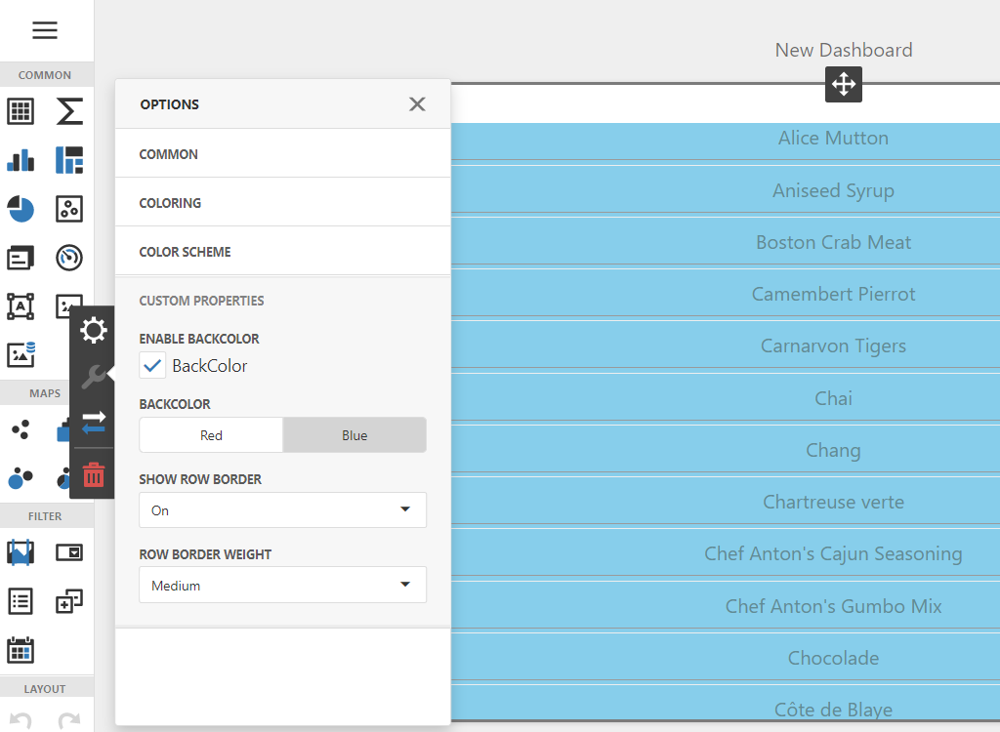

# Web Dashboard - How to implement dependent custom properties in a custom item

This example demonstrates how to implement a [Custom Item](https://docs.devexpress.com/Dashboard/119837/web-dashboard/client-side-customization/custom-item/create-a-data-aware-item?p=netframework) with [Custom Properties](https://docs.devexpress.com/Dashboard/401702/web-dashboard/client-side-customization/custom-properties) that depend on each other. We create the following custom properties:

- `backColorEnabledProperty`
- `backColorProperty`
- `rowBorderVisibleProperty`
- `rowBorderWeightProperty`

The UI of `backColorProperty` is enabled when `backColorEnabledProperty` is set to true.
The UI of `rowBorderWeightProperty` is visible when `rowBorderVisibleProperty` is set to true.

We handle the following [ICustomItemMetaData.optionsPanelSections](https://docs.devexpress.com/Dashboard/js-DevExpress.Dashboard.Model.ICustomItemMetaData?p=netframework#js_devexpress_dashboard_model_icustomitemmetadata_optionspanelsections) events to implement this behavior: 

- [SectionOptions.onInitialized](https://docs.devexpress.com/Dashboard/js-DevExpress.Dashboard.Designer.SectionOptions#js_devexpress_dashboard_designer_sectionoptions_oninitialized) - for initial configuration,
- [SectionOptions.onFieldDataChanged](https://docs.devexpress.com/Dashboard/js-DevExpress.Dashboard.Designer.SectionOptions#js_devexpress_dashboard_designer_sectionoptions_onfielddatachanged) - for configuration after changes.

The `changeVisibleState` and `changeDisabledState` methods (see [CustomItem.js](CS/Scripts/CustomItem.js)) use the API of the [dxForm](https://js.devexpress.com/Documentation/ApiReference/UI_Widgets/dxForm/) widget to apply visual state changes. Item content is rendered based on custom property values in the [CustomItemViewer.renderContent](https://docs.devexpress.com/Dashboard/js-DevExpress.Dashboard.CustomItemViewer?p=netframework#js_devexpress_dashboard_customitemviewer_rendercontent_element_changeexisting_) method.

## Documentation

* [Create Custom Properties](https://docs.devexpress.com/Dashboard/401702/web-dashboard/ui-elements-and-customization/create-custom-properties)
