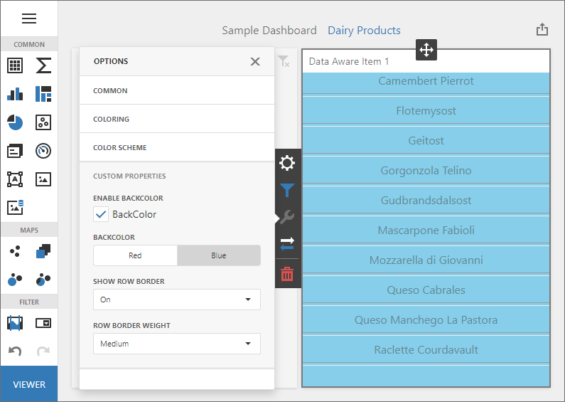

<!-- default badges list -->

<!-- default badges end -->

## ASP.NET Core Dashboard - How to implement dependent custom properties in a custom item

This example shows how to implement a [Custom Item](https://docs.devexpress.com/Dashboard/119837/web-dashboard/client-side-customization/custom-item/create-a-data-aware-item?p=netframework) with [Custom Properties](https://docs.devexpress.com/Dashboard/401702/web-dashboard/client-side-customization/custom-properties) that depend on each other. 

## Files to Look At

* [CustomDataAwareItem.js](\CS\AspNetCoreCustomItemDependentProperties\wwwroot\js\CustomDataAwareItem.js)

The custom item contains the following custom properties:

- `backColorEnabledProperty`
- `backColorProperty`
- `rowBorderVisibleProperty`
- `rowBorderWeightProperty`

The UI of `backColorProperty` is enabled when `backColorEnabledProperty` is set to `true`.

The UI of `rowBorderWeightProperty` is visible when `rowBorderVisibleProperty` is set to `true`.

The control handles the following [ICustomItemMetaData.optionsPanelSections](https://docs.devexpress.com/Dashboard/js-DevExpress.Dashboard.Model.ICustomItemMetaData?p=netframework#js_devexpress_dashboard_model_icustomitemmetadata_optionspanelsections) events to implement this behavior: 

- [SectionOptions.onInitialized](https://docs.devexpress.com/Dashboard/js-DevExpress.Dashboard.Designer.SectionOptions#js_devexpress_dashboard_designer_sectionoptions_oninitialized) - for initial configuration.
- [SectionOptions.onFieldDataChanged](https://docs.devexpress.com/Dashboard/js-DevExpress.Dashboard.Designer.SectionOptions#js_devexpress_dashboard_designer_sectionoptions_onfielddatachanged) - for configuration after changes.

The `changeVisibleState` and `changeDisabledState` methods use the API of the DevExtreme [dxForm](https://js.devexpress.com/Documentation/ApiReference/UI_Widgets/dxForm/) widget to apply visual state changes. Item content is rendered based on custom property values in the [CustomItemViewer.renderContent](https://docs.devexpress.com/Dashboard/js-DevExpress.Dashboard.CustomItemViewer?p=netframework#js_devexpress_dashboard_customitemviewer_rendercontent_element_changeexisting_) method.

## Documentation

* [Create Custom Properties](https://docs.devexpress.com/Dashboard/401702/web-dashboard/ui-elements-and-customization/create-custom-properties)

## More Examples

- [Dashboard for ASP.NET Core - Custom Properties](https://github.com/DevExpress-Examples/asp-net-core-dashboard-custom-properties-sample)
- [ASP.NET Web Forms Dashboard Control - Custom Properties](https://github.com/DevExpress-Examples/asp-net-web-forms-dashboard-custom-properties-sample)
- [ASP.NET MVC Dashboard Control - Custom Properties](https://github.com/DevExpress-Examples/asp-net-mvc-dashboard-custom-properties-sample)
- [Dashboard Component for Angular - Custom Properties](https://github.com/DevExpress-Examples/angular-with-asp-net-core-dashboard-custom-properties-sample)
- [WinForms Dashboard Designer - Custom Properties](https://github.com/DevExpress-Examples/winforms-dashboard-custom-properties)
- [WPF Dashboard Viewer - Custom Properties](https://github.com/DevExpress-Examples/wpf-dashboard-custom-properties)
- [Multiplatform Example - Constant Lines](https://github.com/DevExpress-Examples/dashboard-constant-lines)
